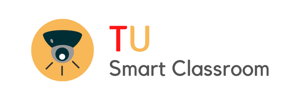

<div align='center'>
    
</div>

---

## Project Information

Project: **_A camera-based near-real time person distance tracking in classrooms_**. Under the supervision of [Dr. Somrudee Deepaisarn](https://www.siit.tu.ac.th/personnel.php?id=252), School of Information, Computer, and Communication Technology, SIIT, Thammasat University and [Prof. Dr. Virach Sornlertlamvanich](https://www.virach.com/), Faculty of Engineering, Thammasat University.

### Publication:

- "Camera-Based Log System for Human Physical Distance Tracking in Classroom", [View on IEEE](https://ieeexplore.ieee.org/document/9980055)

## Setup

### Requirements

- Python 3.10
- A MongoDB Cluster (for storing/accessing log info)
- Pre-trained (YOLO v3) weights, [Link to download](https://mega.nz/folder/Wk9mhZwY#DHWTOaLFBaAlYl4u4PgC2g)
- Sample footage (to test demo endpoints)

#### 1. Create a `weights` folder in the root directory and store the downloaded pre-trained weights

#### 2. Create a `sample-footage` folder in the root directory and store your sample footage

#### 3. Add your MongoDB connection string in `app/configs.py` to connect with your MongoDB Cluster

```
DATABASE_URL = "YOUR_MONGODB_CONNECTION_STRING"
```

#### 4. Create a python environment and install required libraries from `requirements.txt`

#### 5. Run and see your work at [localhost:80](http://localhost:80)!

```
$ uvicorn app.main:app --port 80
```

## Helpful Resources

- [FastAPI Docs](https://fastapi.tiangolo.com)
- [MongoDB](https://www.mongodb.com)
- [PyMongo Docs](https://pymongo.readthedocs.io/en/stable/)
- [Jinja Templates](https://jinja.palletsprojects.com/en/3.1.x/)
- [Perspective Transform OpenCV](https://medium.com/analytics-vidhya/opencv-perspective-transformation-9edffefb2143)
- [Containerizing Python Applications with Docker](https://www.youtube.com/watch?v=0UG2x2iWerk)
- [Websocket API](https://developer.mozilla.org/en-US/docs/Web/API/WebSockets_API)
